# feat: Add local PDF reader with dyslexia features

## Summary

Add a dedicated PDF reader page to the Chrome extension that renders local PDFs as accessible HTML text via pdf.js, then applies all four existing dyslexia reading features (font switching, bionic reading, TTS, reading ruler). Users load PDFs via popup button or drag-and-drop; all processing stays local.

---

## Problem Frame

Dyslexia Tool currently serves only web pages. Users needing PDF reading assistance — lecture notes, research papers, reports — must use separate tools or struggle with standard PDF rendering. Adding a local PDF reader closes this gap and creates a unified reading companion without introducing server-side dependencies.

(see origin: docs/brainstorms/2026-06-05-pdf-reader-requirements.md)

---

## Requirements

**Origin actors:** A1 (Dyslexic Reader), A2 (Extension PDF Reader Page)

**Origin flows:** F1 (Open via Popup), F2 (Open via Drag-and-Drop), F3 (Apply Dyslexia Features to PDF)

**Origin acceptance examples:** AE1 (popup open), AE2 (drag-drop), AE3 (font switching), AE4 (bionic reading), AE5 (TTS), AE6 (page navigation), AE7 (local-only privacy)

- R1. User opens a local PDF via popup "Open PDF" button → native file picker → reader page
- R2. User drags-and-drops a .pdf onto the reader page to open it
- R3. PDF content renders as accessible HTML text layer preserving reading order and text selection
- R4. Font switching (OpenDyslexic/Arial/Verdana) with adjustable spacing works on PDF text
- R5. Bionic Reading mode works on PDF text
- R6. TTS via Web Speech API works on user-selected PDF text
- R7. Reading ruler works on PDF text
- R8. Multi-page navigation (prev/next, jump to page number)
- R9. Reading feature toggles accessible from within the reader page
- R10. Dark mode applies to reader page UI chrome
- R11. All PDF processing is local — no data transmission
- R12. Minimum new manifest permissions for local file access

---

## Scope Boundaries

- Spell checking and voice notes do not apply to PDF content (read-only)
- Scanned/image PDFs without selectable text layer show a canvas fallback with a warning banner — no OCR
- PDF annotations, form filling, editing, and export are out of scope
- Per-PDF settings are out of scope — global settings only
- Online PDF URLs are deferred (existing web page features may handle them if rendered as HTML)

### Deferred to Follow-Up Work

- Bionic reading ratio customization (slider) — hardcoded 0.45 for MVP
- Continuous scroll mode for multi-page PDFs — single-page mode only for MVP
- File System Access API upgrade from `<input type="file">` — for persistent "recently opened" list
- Recently-opened PDFs list — separate UX feature

---

## Context & Research

### Relevant Code and Patterns

- **Page registration pattern:** `popup/index.html` + `src/popup/main.tsx` → `vite.config.ts` `rollupOptions.input` → `manifest.json` entry. Mirror this exactly for the reader page.
- **Content script feature modules:** `src/content/font-injection.ts` (CSS-based, `document.body`), `src/content/bionic-reading.ts` (TreeWalker + MutationObserver on `document.body`), `src/content/tts.ts` (Web Speech API, `window.getSelection()`), `src/content/reading-ruler.ts` (`position: fixed` overlay on `document.body`). These are tightly coupled to `document.body` and cannot run on the reader page without modification.
- **Message passing:** `src/shared/types/messages.ts` — central `MessageMap` interface. All extension messages typed here. Helper functions `sendMessage<T>()` and `sendTabMessage<T>()` in same file. Background handler in `src/background/index.ts`. Note: `sendTabMessage` uses `chrome.tabs.sendMessage` which targets content scripts only — reader page (extension page) must use `chrome.runtime.sendMessage` or direct hook access instead.
- **State management:** `src/options/hooks/useSettings.ts` — Zustand store with Dexie persistence. Settings type in `src/shared/types/storage.ts`. Reader page should read from Dexie on mount to initialize feature states.
- **Font loading:** Fonts in `fonts/` directory, declared in `web_accessible_resources`. Content script resolves via `chrome.runtime.getURL()`. Reader page can use the same mechanism or Tailwind CSS font declarations.
- **Test patterns:** `src/test/storage.test.ts` — Vitest with `jsdom`, `fake-indexeddb/auto`, mocked `chrome.*` API in `src/test/setup.ts`. No React component tests exist yet. The existing mock covers `chrome.storage.local` and `chrome.tabs.sendMessage`; U5 will need `chrome.storage.session` and `chrome.tabs.create` extensions to the test setup mocks.

### Institutional Learnings

- No existing `docs/solutions/` entries. This plan introduces a significant new architecture pattern (extension page + bundled rendering engine + reused transformation pipeline) worth documenting via `/ce-compound` after landing.

### External References

- **pdf.js v6.x in Chrome MV3:** Worker served from `public/workers/` + `chrome.runtime.getURL()`. CRXJS does not resolve `new URL('pdfjs-dist/build/pdf.worker.min.mjs', import.meta.url)` in extension context. Use static file copy approach.
- **pdf.js text extraction:** `page.getTextContent()` returns `TextItem[]` with position data in PDF coordinate space. Transform to viewport coordinates for absolutely-positioned text spans.
- **CSP for pdf.js:** Manifest V3 default CSP blocks pdf.js workers. Must add `content_security_policy` allowing `script-src 'self' 'wasm-unsafe-eval'` and `worker-src 'self' blob:`.
- **Extension popup handoff:** Popup closes when focus changes. File data must survive the transition. Use `chrome.storage.session` (MV3 ephemeral, 10MB per key, auto-cleaned on browser close) to pass the ArrayBuffer from popup to reader page.

---

## Key Technical Decisions

- **React-based feature implementations on reader page** (not content script injection): Existing content script modules are hardwired to `document.body` and MutationObserver patterns. Injecting the content script into `chrome-extension://` pages introduces conflict surface. The reader page is a standalone React app that implements feature logic on its own DOM text layer.
- **Custom text layer** (not pdfjsViewer): The built-in `pdfjsViewer.TextLayerBuilder` adds ~80KB gzipped and abstracts the DOM away. A custom text layer gives full control over text spans for font manipulation and bionic reading.
- **`<input type="file">` for file picking** (MVP): Simpler than File System Access API, requires zero new manifest permissions, broad browser support. Sufficient for occasional PDF loading.
- **pdf.js built-in worker only** — no extra Web Worker: `getTextContent()` dispatches to pdf.js's own worker thread. Performance is adequate for typical academic/business PDFs (<100 pages). Adding a wrapper worker provides no benefit.
- **Shared pure text transformation** extracted from bionic reading: Pull `applyBionicReading(text: string, ratio: number): string` into `src/shared/` so both the content script and reader page import it. The DOM mutation parts stay context-specific (content script uses TreeWalker; reader page applies to text layer spans).
- **`chrome.storage.session` for popup→reader handoff**: Ephemeral, auto-cleaned, no schema migration. The popup reads the file, stores it, opens the reader tab, which retrieves and clears the stored buffer.

---

## Open Questions

### Resolved During Planning

- **File System Access API vs `<input type="file">`**: `<input type="file">` chosen for MVP (simpler, no permissions, sufficient for occasional use). File System Access API deferred to follow-up.
- **pdf.js worker vs extra Web Worker**: pdf.js built-in worker sufficient. No wrapper worker needed.
- **Content script reuse vs React equivalents**: React equivalents chosen. Shared pure functions extracted for reuse where possible.
- **Popup→reader data handoff**: `chrome.storage.session` chosen.

### Deferred to Implementation

- Exact CSP directive values — test with real pdf.js worker build to confirm minimal required set
- Whether `canvas` dependency in package.json conflicts with pdf.js — pdf.js uses browser Canvas API, not the Node canvas package; may be removable
- Exact layout of reader page controls (sidebar vs. toolbar vs. floating panel) — UX preference best resolved during implementation
- Whether bionic reading ratio should be added to the Settings type — deferred per scope boundaries

---

## Output Structure

```
apps/extension/
  ├── scripts/
│       └── copy-pdf-worker.js            ← new: copies worker from node_modules at build time
  ├── public/
│       └── workers/
│           └── pdf.worker.min.mjs          ← new: generated by postinstall script
├── reader/
│   └── index.html                      ← new: reader page entry point
├── src/
│   ├── reader/                         ← new: reader page React app
│   │   ├── main.tsx
│   │   ├── App.tsx
│   │   ├── hooks/
│   │   │   ├── usePdfDocument.ts
│   │   │   └── usePdfPage.ts
│   │   ├── components/
│   │   │   ├── TextLayer.tsx
│   │   │   ├── PageCanvas.tsx
│   │   │   ├── PageNavigation.tsx
│   │   │   ├── FeatureToolbar.tsx
│   │   │   ├── FileDropZone.tsx
│   │   │   ├── PasswordDialog.tsx
│   │   │   └── ErrorBanner.tsx
│   │   └── features/
│   │       ├── font-injection.ts       ← new: reader-specific font injection
│   │       ├── bionic-reading.ts        ← new: reader-specific bionic reading
│   │       ├── tts.ts                   ← new: reader-specific TTS
│   │       └── reading-ruler.ts         ← new: reader-specific reading ruler
│   ├── shared/
│   │   └── text/
│   │       └── bionic-reading.ts        ← new: shared pure function extracted from content
│   ├── content/
│   │   └── bionic-reading.ts            ← modify: import shared pure function
│   └── popup/
│       └── App.tsx                      ← modify: add "Open PDF" button + handoff logic
├── manifest.json                        ← modify: CSP, web_accessible_resources
└── vite.config.ts                       ← modify: add reader entry point
```

---

## High-Level Technical Design

*This illustrates the intended approach and is directional guidance for review, not implementation specification. The implementing agent should treat it as context, not code to reproduce.*

### PDF Loading Sequence

```mermaid
sequenceDiagram
    participant User
    participant Popup
    participant ServiceWorker
    participant ReaderPage
    participant PdfJS

    User->>Popup: Click "Open PDF"
    Popup->>Popup: <input type="file"> → FileReader → ArrayBuffer
    Popup->>ServiceWorker: chrome.storage.session.set({pdfBuffer, pdfName})
    Popup->>User: chrome.tabs.create('reader/index.html')
    ReaderPage->>ServiceWorker: chrome.storage.session.get('pdfBuffer')
    ServiceWorker-->>ReaderPage: ArrayBuffer + pdfName
    ReaderPage->>PdfJS: getDocument({data: buffer})
    PdfJS-->>ReaderPage: PDFDocumentProxy
    ReaderPage->>ReaderPage: Render page 1 (canvas + text layer)
```



### Text Layer Rendering Pipeline

```mermaid
graph LR
    A[PDF Page] --> B[pdf.js getTextContent]
    B --> C[TextItem[] with positions]
    C --> D[Transform PDF coords → viewport coords]
    D --> E[Create absolutely-positioned spans]
    E --> F[Text Layer DOM]
    F --> G[Feature Pipeline]
    G --> H1[Font Injection: CSS font-family on layer]
    G --> H2[Bionic Reading: bold-first-45% per word]
    G --> H3[TTS: SpeechSynthesis on selection]
    G --> H4[Reading Ruler: fixed-position highlight]
```

---

## Implementation Units

### U1. Scaffold reader page and build infrastructure

**Goal:** Create the reader page entry point, React app shell, Vite/build registration, manifest permissions, and CSP configuration so pdf.js can load and all subsequent units have a working target.

**Requirements:** R12, R11

**Dependencies:** None

**Files:**
- Create: `reader/index.html`
- Create: `src/reader/main.tsx`
- Create: `src/reader/App.tsx`
- Create: `scripts/copy-pdf-worker.js` (postinstall script to copy worker from node_modules)
- Create: `public/workers/pdf.worker.min.mjs` (copied from node_modules)
- Modify: `vite.config.ts` (add `reader: 'reader/index.html'` to `rollupOptions.input`)
- Modify: `manifest.json` (add `content_security_policy`, add `workers/*` to `web_accessible_resources`)
- Test: `src/reader/__tests__/scaffold.test.tsx`

**Approach:**
- Mirror the existing popup/options page registration pattern exactly
- Copy `pdf.worker.min.mjs` from `node_modules/pdfjs-dist/build/` to `public/workers/` as a build script (add npm script: `"postinstall": "node scripts/copy-pdf-worker.js"`)
- CSP entry in manifest: `"content_security_policy": { "extension_pages": "script-src 'self' 'wasm-unsafe-eval'; worker-src 'self' blob:; object-src 'self'" }`
- `web_accessible_resources` add `"workers/*"` to existing resources array
- Reader page is not registered as a manifest page type — it's opened via `chrome.tabs.create({ url: 'reader/index.html' })` from the popup

**Patterns to follow:**
- `popup/index.html` and `options/index.html` — identical HTML entry structure
- `src/popup/main.tsx` and `src/options/main.tsx` — React mount pattern

**Test scenarios:**
- Happy path: `npm run build` succeeds with reader page in dist output; `reader/index.html` resolves in extension
- Integration: Opening `chrome-extension://[id]/reader/index.html` renders the App shell without console errors
- Happy path: pdf.js worker URL resolves via `chrome.runtime.getURL('workers/pdf.worker.min.mjs')`

**Verification:**
- Extension builds without errors, reader page loads as a blank React app in a new tab
- pdf.js worker file present in built `dist/workers/` directory
- No CSP errors in extension page console

---

### U2. Integrate pdf.js document loading and canvas rendering

**Goal:** Initialize pdf.js with the bundled worker, load PDF documents from ArrayBuffer, and render individual pages to canvas. This is the rendering foundation; text layer extraction comes in U3.

**Requirements:** R3

**Dependencies:** U1

**Files:**
- Create: `src/reader/hooks/usePdfDocument.ts`
- Create: `src/reader/hooks/usePdfPage.ts`
- Create: `src/reader/components/PageCanvas.tsx`
- Modify: `src/reader/App.tsx` (integrate hooks)
- Test: `src/reader/__tests__/usePdfDocument.test.ts`
- Test: `src/reader/__tests__/PageCanvas.test.tsx`

**Approach:**
- `usePdfDocument`: Accepts `ArrayBuffer | null`, returns `{ pdf, loading, error, currentPage, totalPages, setPage }`. Handles lifecycle: cancels loading task on unmount, destroys document proxy on cleanup. Wraps `pdfjsLib.getDocument({ data })` with proper error states.
- `usePdfPage`: Accepts `pdf` and `pageNumber`, returns `{ canvasRef, page }`. Renders page to canvas via `page.render()`. Cancels render task on page change or unmount.
- `PageCanvas`: React component wrapping the canvas element with device-pixel-ratio scaling.
- pdf.js worker configured once in `src/shared/pdf/init.ts`: `GlobalWorkerOptions.workerSrc = chrome.runtime.getURL('workers/pdf.worker.min.mjs')`.

**Patterns to follow:**
- React custom hooks with `useRef` for render task cancellation (standard React + canvas pattern)
- Error state display following the popup's error pattern (`src/popup/App.tsx` error handling)

**Test scenarios:**
- Happy path: Load a small valid PDF ArrayBuffer → `usePdfDocument` returns `pdf` with correct `totalPages`, `loading: false`
- Happy path: `usePdfPage` renders canvas at viewport dimensions with non-blank content
- Edge case: Unmount during loading → loading task destroyed, no state update on unmounted component
- Edge case: Rapid page change (click next 3 times fast) → only final page renders, intermediate tasks cancelled
- Error path: Invalid/corrupt PDF → `error` state set, `pdf` is null
- Error path: Zero-byte ArrayBuffer → error state, no crash

**Verification:**
- Opening a known-good test PDF renders the first page as a visible image on canvas
- Page count is correct
- No "Setting up fake worker" console warning
- No memory leaks on component unmount (verify with browser Performance monitor)

---

### U3. Build custom text layer from pdf.js text content

**Goal:** Extract text content with position data from pdf.js and render it as absolutely-positioned HTML spans, forming an invisible-but-selectable text layer that sits on top of the canvas. This layer is the DOM surface that reading features (U4) operate on.

**Requirements:** R3

**Dependencies:** U2

**Files:**
- Create: `src/reader/components/TextLayer.tsx`
- Create: `src/shared/pdf/text-layer.ts` (pure function: PDF text items → positioned DOM spans)
- Test: `src/shared/pdf/__tests__/text-layer.test.ts`
- Test: `src/reader/__tests__/TextLayer.test.tsx`

**Approach:**
- `buildTextLayer(textContent, viewport, container)` in `src/shared/pdf/text-layer.ts`:
  - Clear container
  - For each `TextItem` in `textContent.items`: create `position: absolute` span, transform PDF coordinates to viewport coordinates (`y_viewport = viewport.height - y_pdf - height`), apply font size from transform matrix, set `color: transparent` + `pointer-events: auto` for selectable-but-invisible text
  - Handle rotated text via `transform: rotate()` when transform matrix has non-zero rotation
- `TextLayer` component: calls `buildTextLayer` in `useEffect`, returns a div container.
- Overlaid on canvas at same dimensions. Canvas z-index below, text layer z-index above.
- Text is transparent by default. When a reading feature activates (U4), text becomes visible with the feature's styling applied.

**Patterns to follow:**
- pdf.js `getTextContent()` API — returns `TextContent` with `items: TextItem[]`, each having `str`, `transform[6]`, `width`, `height`, `fontName`

**Test scenarios:**
- Happy path: Single-page PDF with known text → text layer contains span elements with correct text content
- Happy path: Text is selectable with mouse (copy-paste works)
- Edge case: PDF page with zero text items → text layer container is empty, no error
- Edge case: PDF with mixed LTR/RTL text → spans positioned correctly, text direction preserved
- Integration: Text layer sits exactly on top of canvas (span positions match rendered text positions)

**Verification:**
- Text from a known test PDF appears as spans in the DOM
- Text can be selected and copied
- Canvas rendering (U2) and text layer (U3) align visually

---

### U4. Extract shared text transformation and build reader page features

**Goal:** Extract the bionic reading text-processing logic into a shared pure utility, then build React-based implementations of font injection, bionic reading, TTS, and reading ruler for the reader page. This is the core value delivery — all four reading features working on PDF text.

**Requirements:** R4, R5, R6, R7

**Dependencies:** U3

**Files:**
- Create: `src/shared/text/bionic-reading.ts` (pure: `applyBionicReading(text, ratio) → string`)
- Create: `src/reader/features/font-injection.ts`
- Create: `src/reader/features/bionic-reading.ts`
- Create: `src/reader/features/tts.ts`
- Create: `src/reader/features/reading-ruler.ts`
- Modify: `src/content/bionic-reading.ts` (import shared pure function instead of inline logic)
- Test: `src/shared/text/__tests__/bionic-reading.test.ts`
- Test: `src/reader/features/__tests__/font-injection.test.ts`
- Test: `src/reader/features/__tests__/bionic-reading.test.ts`
- Test: `src/reader/features/__tests__/tts.test.ts`

**Approach:**
- **Shared bionic reading:** Extract `function applyBionicReading(text: string, ratio: number = 0.45): string` that splits words and wraps first ~45% in bold markup. Pure, no DOM dependency. Both content script and reader page import this.
- **Reader font injection:** Applies CSS to the text layer container: `fontFamily`, `lineHeight`, `letterSpacing`. Reads settings from Dexie on activation. More targeted than content script — applies to the text layer div, not `document.body *`.
- **Reader bionic reading:** Queries all spans in the text layer, applies `applyBionicReading()` to each span's text content, makes spans visible (`color: inherit`). Re-applies on page change.
- **Reader TTS:** Uses `window.speechSynthesis` same as content script. Operates on the text layer DOM selection. Auto-stops when page changes (cleanup in `usePdfPage`). Respects `ttsSpeed` from Dexie settings.
- **Reader reading ruler:** Renders a `position: fixed` horizontal bar tracking mouse Y, same behavior as content script but scoped to the reader page viewport. Uses `pointer-events: none` to not interfere with text selection.

**Patterns to follow:**
- `src/content/font-injection.ts` — CSS-based font application with `@font-face` resolution
- `src/content/bionic-reading.ts` — text splitting logic (extract the inline bionic algorithm)
- `src/content/tts.ts` — `SpeechSynthesisUtterance` with rate control
- `src/content/reading-ruler.ts` — fixed-position div with `mousemove` listener

**Test scenarios:**
- Happy path: Enable OpenDyslexic → text layer spans get `fontFamily: "OpenDyslexic"`
- Happy path: Enable bionic reading → first ~45% of each word in every span is bold
- Happy path: Select text and trigger TTS → selected text spoken at configured speed
- Happy path: Enable reading ruler → horizontal bar follows mouse, aligns with text lines
- Happy path: Disable a feature → text layer returns to default (fonts removed, spans cleared, etc.)
- Edge case: Feature persists across page navigation (font/bionic/ruler re-applied after new page renders)
- Error path: TTS auto-stops when page changes mid-utterance → no stale speech
- Integration: Covers AE3 (font switching), AE4 (bionic reading), AE5 (TTS)

**Verification:**
- All four features toggle on/off from the reader page
- Visual comparison: PDF text with OpenDyslexic + bionic reading looks similar to web page experience
- No regression: existing content script bionic reading behavior unchanged
- TTS stops cleanly on page change

---

### U5. File loading flow: popup button and drag-and-drop

**Goal:** Add the "Open PDF" button to the extension popup with the handoff mechanism to the reader page, and add drag-and-drop support directly on the reader page. Includes file validation, password-protected PDF handling, and size warnings.

**Requirements:** R1, R2, R11, R12

**Dependencies:** U1, U2

**Files:**
- Modify: `src/popup/App.tsx` (add "Open PDF" button + file picker + storage.session handoff)
- Create: `src/reader/components/FileDropZone.tsx`
- Create: `src/reader/components/PasswordDialog.tsx`
- Modify: `src/reader/App.tsx` (integrate file drop + password flow)
- Test: `src/popup/__tests__/pdf-open.test.tsx`
- Test: `src/reader/__tests__/FileDropZone.test.tsx`

**Approach:**
- **Popup "Open PDF" button:** Invisible `<input type="file" accept=".pdf,application/pdf">` triggered by button click. On file select, read as ArrayBuffer via `FileReader`. Store `{ buffer, name }` in `chrome.storage.session`. Open `reader/index.html` in new tab via `chrome.tabs.create()`. Close popup.
- **Reader page on mount:** Check `chrome.storage.session` for pending PDF data. If found, load it, clear the session key. If not found, show drop zone / empty state.
- **Drag-and-drop:** `FileDropZone` component listens for `dragover`/`drop` events. Validates file is `.pdf`. Shows visual feedback (border highlight on dragover, filename on drop). Reads file as ArrayBuffer and passes to pdf document hook.
- **Password handling:** If `pdfjsLib.getDocument()` throws `PasswordException`, show `PasswordDialog` modal. Retry with user-provided password via `getDocument({ data, password })`. Show error on wrong password.
- **File validation:** Check file extension and MIME type. Reject non-PDFs with user feedback. Warn on files >100MB ("Large file — may take a moment to load"). No hard rejection.

**Patterns to follow:**
- `src/popup/App.tsx` existing toggle button pattern for styling
- Chrome Extension popup — must close before file picker opens (popup loses focus)

**Test scenarios:**
- Happy path (popup): Click "Open PDF" → file picker → select valid PDF → reader tab opens with PDF rendered. Covers AE1.
- Happy path (drag): Drag .pdf onto reader page drop zone → border highlights → file accepted → PDF renders. Covers AE2.
- Edge case: Cancel file picker (no file selected) → popup stays, no reader tab opened
- Edge case: Drop non-PDF file → visual rejection feedback, no loading attempt
- Edge case: Drag file over drop zone but don't drop → highlight appears then disappears on dragleave
- Error path: Password-protected PDF → password dialog shown → correct password → PDF loads
- Error path: Password-protected PDF → wrong password → error message, dialog re-shown
- Error path: Corrupt file → error state displayed in reader page
- Integration: Reader page handles both popup-initiated and drag-drop-initiated loading paths uniformly

**Verification:**
- Both loading paths work end-to-end (popup button and drag-and-drop)
- Password dialog appears for protected PDFs and accepts correct credentials
- File validation rejects non-PDFs with clear feedback
- Large file warning appears for >100MB files

---

### U6. Reader page UI: navigation, controls, dark mode, and edge states

**Goal:** Build the reader page's full UI surface — page navigation controls, feature toggles, dark mode, loading states, error states, and the scanned-PDF fallback experience.

**Requirements:** R8, R9, R10

**Dependencies:** U3, U4, U5

**Files:**
- Create: `src/reader/components/PageNavigation.tsx`
- Create: `src/reader/components/FeatureToolbar.tsx`
- Create: `src/reader/components/ErrorBanner.tsx`
- Modify: `src/reader/App.tsx` (full layout, state routing, integrate all components)
- Modify: `src/reader/index.html` (dark mode class support)
- Test: `src/reader/__tests__/PageNavigation.test.tsx`
- Test: `src/reader/__tests__/FeatureToolbar.test.tsx`

**Approach:**
- **Page navigation:** `PageNavigation` shows prev/next buttons, current page / total pages display, and a page number input that accepts direct entry + Enter to jump. Disabled states: prev on page 1, next on last page. ArrowLeft/ArrowRight keyboard shortcuts navigate pages. Uses `usePdfDocument.setPage()`. Covers AE6.
- **Feature toolbar:** `FeatureToolbar` renders toggle buttons for all four features (font, bionic, TTS, ruler). When a feature is active, its button shows an active/on state. Toolbar reads initial states from Dexie settings on mount (matching options page pattern). Toolbar is positioned in a sidebar or top bar within the reader page.
- **Dark mode:** Reader page body class toggles based on Dexie `theme` setting (light/dark/system). Tailwind `dark:` classes applied to UI chrome (toolbar, nav bar, background). Text layer canvas and spans are unaffected by dark mode (PDF content stays as-rendered).
- **Loading state:** Full-page spinner or skeleton while pdf.js parses. Page-level skeleton while individual pages render.
- **Error states:** Corrupt PDF (invalid format), failed to load (permissions, file moved), scanned PDF (no text layer — show canvas-only fallback with "Text features unavailable" warning banner). Each has a distinct message and recovery suggestion.
- **Empty state:** When reader page opens without a pending PDF (e.g., opened directly), show the drag-and-drop zone as the primary CTA with a "or select a file" button.

**Patterns to follow:**
- `src/popup/App.tsx` toggle button UI pattern (icon + label, active/inactive visual state)
- `src/options/App.tsx` dark mode integration with Tailwind
- `src/options/hooks/useSettings.ts` Dexie read pattern for initial state

**Test scenarios:**
- Happy path: Navigate 10-page PDF using prev/next → page content updates, prev disabled on page 1, next disabled on page 10. Covers AE6.
- Happy path: Enter "5" in page input + Enter → jumps to page 5
- Happy path: Toggle features from toolbar → feature applies to text layer, button shows active state
- Happy path: Open reader page with dark mode enabled in settings → toolbar and background use dark theme
- Edge case: Enter page number > total pages → clamped to last page
- Edge case: Enter page number < 1 or non-numeric → ignored or clamped to 1
- Error state: Scanned PDF (empty text content) → canvas visible, warning banner displayed, feature toolbar buttons disabled
- Error state: Corrupt PDF → error message with "try another file" suggestion
- Loading state: Large PDF → spinner visible during initial parse
- Empty state: Reader page opened directly (no pending PDF) → drop zone CTA visible

**Verification:**
- Page navigation works correctly for multi-page PDFs
- Feature toolbar toggles visually reflect on/off state and affect the text layer
- Dark mode applies to UI chrome without affecting PDF content rendering
- Each error/edge state renders appropriate feedback

---

## System-Wide Impact

- **Interaction graph:** Popup gains a new button and file-picker integration. Background service worker unaffected (storage.session is a direct Chrome API, no message routing needed). Reader page is a new isolated surface — does not interact with content scripts.
- **Error propagation:** pdf.js errors (corrupt file, password required, unsupported format) surface in reader page UI components. File access errors (permissions, file not found) surface as popup-level or reader-level errors.
- **State lifecycle risks:** `chrome.storage.session` key must be cleared on successful load to prevent stale data on next reader page open. TTS must be explicitly cancelled on page change to avoid stale utterances referencing destroyed DOM.
- **Unchanged invariants:** Content script features on web pages are unchanged. Popup toggle behavior for web pages is unchanged. Options page settings UI is unchanged. Font files in `fonts/` are unchanged. The bionic reading content script module is modified (U4) but behavior is preserved — only the text-splitting logic is deduplicated.
- **Integration coverage:** End-to-end flow: popup → file picker → reader tab → pdf.js load → text layer → enable bionic reading → text transforms visibly → select text → TTS plays → next page → TTS stops, bionic re-applies. This multi-layer integration cannot be proven by unit tests alone.

---

## Risks & Dependencies

| Risk | Mitigation |
|------|------------|
| pdf.js CSP blocks worker in production build despite dev success | Test CSP with production build (not just dev server) early in U1. Add `wasm-unsafe-eval` and `blob:` worker-src per research. |
| Content script bionic reading regression from extraction refactor | Keep existing tests passing. The extraction is a pure function — verify identical output for all word inputs. |
| chrome.storage.session 10MB per-key limit exceeded by large PDFs | Check ArrayBuffer.byteLength before storing. If >10MB, use IndexedDB temporary store or pass via service worker message relay instead. |
| pdf.js adds ~400KB gzipped to extension size | Within Chrome Web Store limits (~100MB). Bundle size impact is minimal relative to feature value. |
| Password-protected PDF UX adds complexity to loading path | pdf.js `onPassword` callback is well-documented. Password dialog is a simple modal component. |

---

## Sources & References

- **Origin document:** [docs/brainstorms/2026-06-05-pdf-reader-requirements.md](../brainstorms/2026-06-05-pdf-reader-requirements.md)
- Related code: `apps/extension/src/content/font-injection.ts`, `apps/extension/src/content/bionic-reading.ts`, `apps/extension/src/content/tts.ts`, `apps/extension/src/content/reading-ruler.ts`
- Related code: `apps/extension/src/popup/App.tsx`, `apps/extension/src/options/hooks/useSettings.ts`
- Related code: `apps/extension/src/shared/types/messages.ts`, `apps/extension/src/shared/types/storage.ts`
- External docs: [pdf.js API](https://github.com/mozilla/pdf.js/wiki), [Chrome MV3 CSP](https://developer.chrome.com/docs/extensions/mv3/intro/mv3-migration/#content-security-policy)
